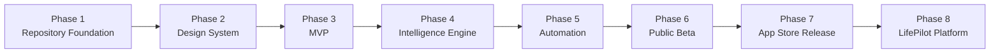

# Roadmap

LifePilot's roadmap is organized into eight phases, from repository foundation through public platform. Each phase has a concrete, demonstrable outcome — no phase is "done" until its outcome is shipped and observable, not just coded.

For the higher-level product framing behind these phases, see [PRODUCT_VISION.md](docs/PRODUCT_VISION.md). For how phases map to version numbers, see [Release Strategy](docs/ENGINEERING_GUIDE.md#release-strategy).

## Phase 1 — Repository Foundation

**Goal:** Establish an engineering foundation a professional team can immediately build on.

- Repository structure, CI/CD pipelines, issue and PR templates
- Contribution guidelines, code of conduct, security policy
- Architecture, product vision, and engineering documentation
- Branching strategy and release process defined and enforced

**Outcome:** A new engineer can clone the repo and understand how to contribute within an hour, with no tribal knowledge required.

## Phase 2 — Design System

**Goal:** A cohesive visual and interaction language before any feature is built on top of it.

- Typography, color, and spacing tokens
- Core component library (cards, lists, buttons, sheets)
- Light and dark theming
- Accessibility baseline (Dynamic Type, VoiceOver, contrast)

**Outcome:** Every future feature is built from a shared, tested component set — not one-off UI.

## Phase 3 — MVP

**Goal:** Prove the core loop end-to-end with real data, even with a single agent.

- Calendar integration (read-only)
- A generated Morning Briefing from live calendar data
- Basic Timeline view merging calendar events chronologically

**Outcome:** A working morning briefing generated from a real calendar — the first end-to-end proof of the product's core loop.

## Phase 4 — Intelligence Engine

**Goal:** Move from summarization to reasoning.

- Ghost Brain core reasoning engine
- Calendar Agent, Email Agent, and Memory Agent
- Cross-domain predictions (e.g. a flight delay affecting a meeting)

**Outcome:** LifePilot produces predictions and recommendations, not just a merged summary.

## Phase 5 — Automation

**Goal:** Let the system act, safely, on the user's behalf.

- Smart Approvals queue with reasoning attached to every recommendation
- Security Agent auditing every proposed action
- Optional, user-defined automation rules for low-risk actions

**Outcome:** Trusted, low-risk actions execute without manual review; everything else still requires explicit approval.

## Phase 6 — Public Beta

**Goal:** Validate the product with real users outside the core team.

- TestFlight distribution
- Feedback and crash-reporting instrumentation
- Expanded agent roster: Travel, Finance, Reminder agents

**Outcome:** A cohort of external users relying on LifePilot for their actual daily routine.

## Phase 7 — App Store Release

**Goal:** Ship a polished, stable 1.0 to the public.

- App Store submission and review
- Shopping and Health agents
- Performance, accessibility, and localization hardening

**Outcome:** LifePilot is publicly available on the App Store as `v1.0.0`.

## Phase 8 — LifePilot Platform

**Goal:** Extend beyond a single app into the intelligence layer described in the [Future Vision](README.md#future-vision).

- Companion web dashboard
- Third-party integration surface for new connected apps
- Expanded agent ecosystem beyond the initial nine domains

**Outcome:** LifePilot becomes the default starting point for a user's day, across surfaces — not just an iOS app.

---

## Status

This roadmap reflects intent, not a committed schedule. Phase boundaries will shift as real engineering and user feedback come in — this file is updated as that happens, not treated as fixed once written.
